# April 14: Finding Parts and making BOM

So i found this supercool project while looking for inspiration on printables [simplyRetroZ5](https://www.printables.com/model/163507-simplyretro-z5-retropie-emulation-handheld) it was too advanced for me tho it has speakers, custom firmware etc which i am not planning to add in my hermes handheld project but this gave me a rough picture on what things i will need to build this project.

Core 
---------------
for Hermes i will use decided to use pi zero 2w instead of pi zero as it is more capable and finding pi zero can't handle nds emulation as it is too underpowered the zero 2w also supports 64bit architechture 

Display 
---------------
For the display any 5 inch display would work we don't need touch etc so i decided to go with the waveshare 5 inch display

Battery
---------------
We need atleast 2000 mah and 3.7v battery so we could get a few hours of backup but along with this we would need a powerboost so it could give a stable 5V and handles charging via usb-c The Adafruit PowerBoost 1000C fits perfectly here since it:
- Boosts battery voltage to stable 5V  
- Handles LiPo charging  
- Provides safe power regulation for portable builds

for the battery we can go with any battery which meets the voltage and capacity requriements also for the power on off we would need a slide switch

Audio
---------------
Currently our goal is only wired 3.5 mm jack to make things simple we could add 1W small speakers maybe later idk so a 3.5 mm audio jack would work 

Control
---------------
for controls we will go with the tactical buttons and maybe a dpad for hard plastic 
- ABXY
- Start / Select
- D-pad (likely a 4-button layout or hard plastic cap design)

Misc
---------------
Other supporting components include:
- MicroSD card slot and storage setup  
- Resistors for pull-ups and button stability  
- Jumper wires and headers for internal wiring  
- Breadboard for initial testing  
- Possible custom PCB later if everything works well  
- Fully 3D printed case for final enclosure  

With all this in mind i created the [BOM.md](https://github.com/Rexaintreal/HermesHandheld/blob/main/bom/bom.md) 

**Total time spent: 1 hour**

# April 15: Creating the Schematic in KiCad
---------------
I have never made a schematic before so this was a really new experience for me I used KiCad since it was free and everyone seems to use it.

---------------

I Started with the power section first i added a Conn_01x02 as the battery block then a SW_SPDT for the slide switch then a Conn_01x04 for the Power Boost 10000C and i used Labeling instead of drawing wires to keep everything clean.

---------------
Then i added the pi zero 2w as a conn_02x20 40 pin block and labled only the pins i actually need 5V GND and the 10 pins for the buttons then i marked everything else as no connect with X marks.

---------------
After this i added all 10 buttons ABXY, Start, Select, D-Pad as SW_Push symbols. originally i was going to add external 10k pull up resistors for each button but turns out the pi zero has internal pull ups which we can enable in the software for simpler schmatic.

---------------

Now i added a 3.5mm audio jack 3 for the wired audio connected to gpio18 (pwn audio) and a conn_01x05 for the waveshare display with HDMI_P and HDMI_N labels. I got some warning about HDMI_P and HDMI_N only connecting to one pin each but thats expected as hdmi is a physical cable. i added a note for it 

---------------

I ran into some ERC errors fixed the no connection on pins and there were some misclicks too the final result had 0 errors with 2 harmless warnings about the hdmi.

---------------

The final schematics can be seen in the Github folder at [PDFLink](https://github.com/Rexaintreal/HermesHandheld/blob/main/schematics/HermesHandheld.pdf)

**Total time spent: 1.5 hours**

# April 16: Designing the bottom shell in onshape

Ive never done any CAD before so this was a very intimidating task for me i decided to use onshape its free and runs on the browser (also i found some tutorials too).

---------------
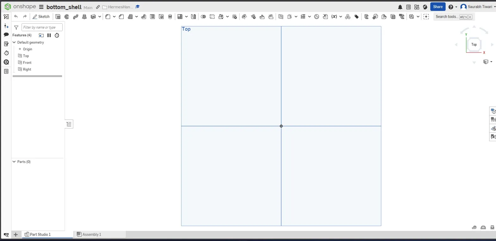

---------------

Before starting i looked up the exact dimensions fo every part from my BOM.md from datasheets so i make the models correctly
- Pi Zero 2W: 65×30×5mm
- Waveshare 5" Display: 121×76×5mm  
- PowerBoost 1000C: 32×19×5mm
- LiPo 3000mAh: 60×50×8mm
- Tactile buttons: 6×6×5mm each

Based on the biggest parts (bettery + pi) i decided to make the bottom shell to be 160mm wide 80mm tall and 15mm deep with 2mm thick cornered walls

---------------

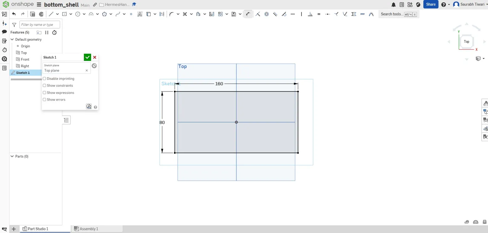

---------------

I started with a sktech o nthe top plane and drew a 160x80mm rectangle and then added a 10mm fillets on all 4 corners (i will regret that - foreshadowing) so it looks like an actual handheld and not a BRICK then used the offset tool at -2mm to create the inner wall boundary

---------------

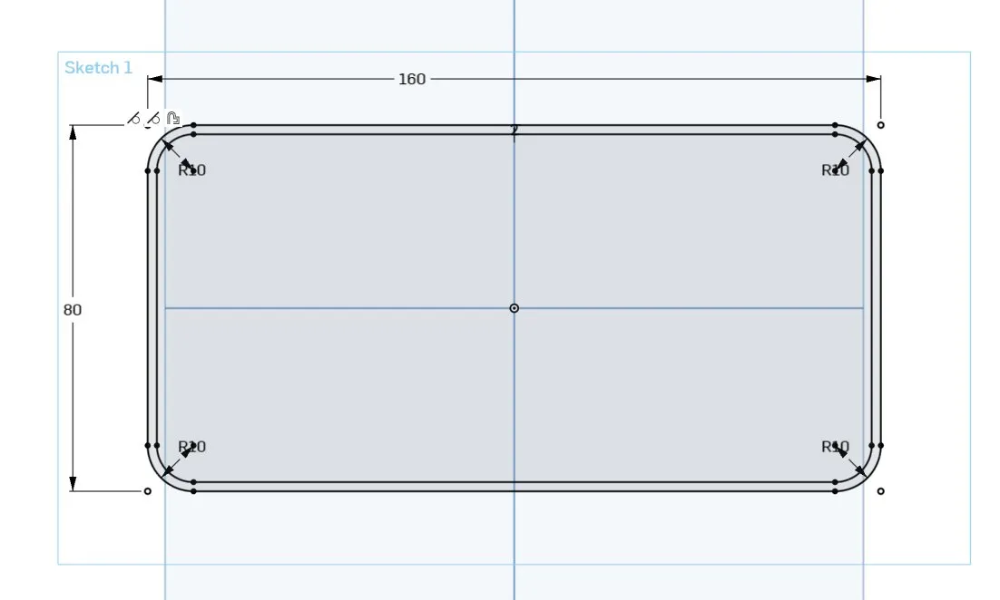

---------------

Extruded the wall profile to 15mm to get the tray shape.

---------------
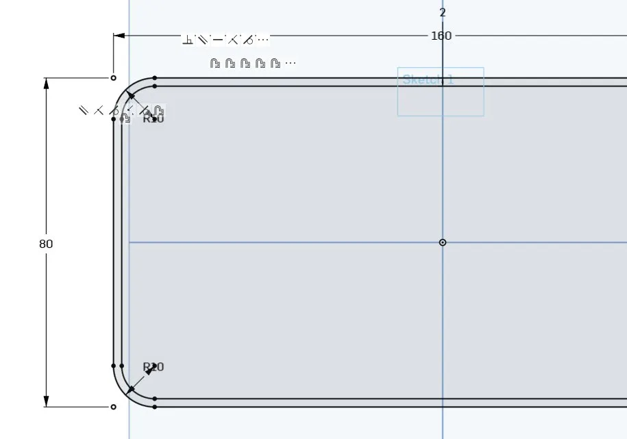

---------------
then i made the floor/base of the case 

---------------
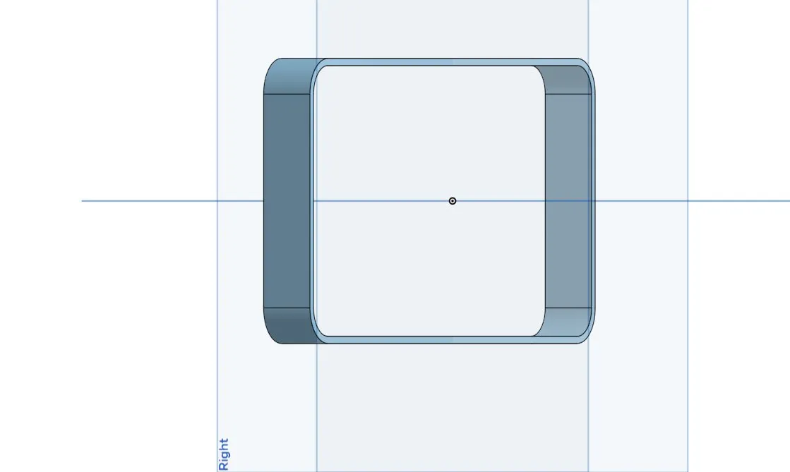

---------------

Now i had to add 4 m2 screws holes in all the four corners (2.2mm dia for clearance) and 5mm from the edges. these go all the way through so the screws can be inserted from the back to hold the top and bottom shell together. 

---------------
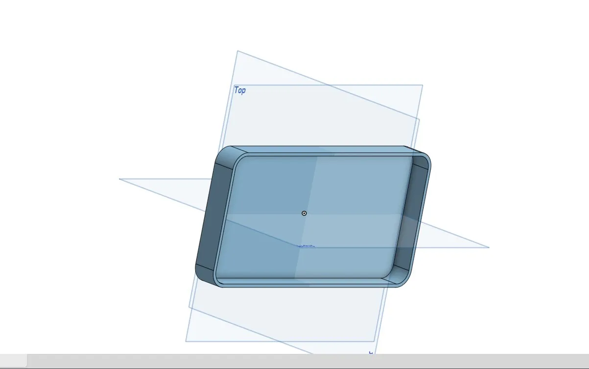

---------------

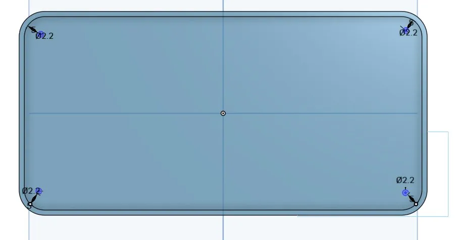

---------------

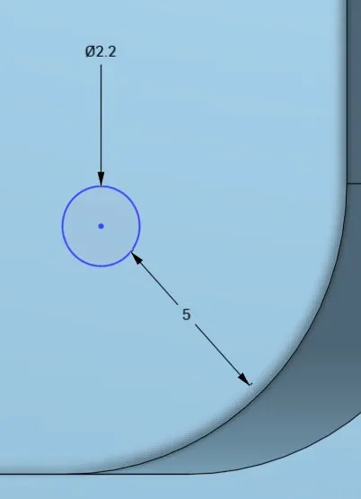

---------------

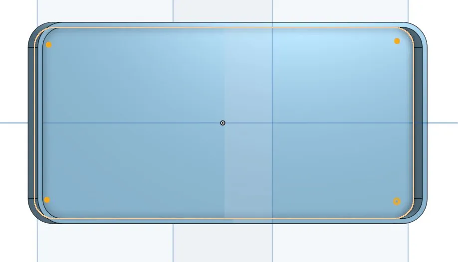

---------------

I struggled with the alginment alot the contrains of being 5mm form the fillet corner works and the dia is also 2.2mm but the placment was inconsistent on all the 4 corners i tried fixing it but i couldnt find any solution and that how i end today's forging session.

---------------

**Total time spent: 1.5 hours**

# April 17: Power Button, Bottom Shell Cuttouts, ABXY buttons and DPad

So i Fixed the screw hole thanks to Anicetus on slack i used the cocentric constraint to make it all aligned 

---------------

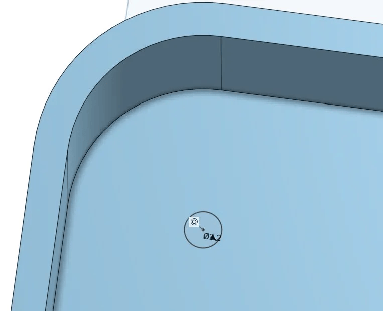

---------------
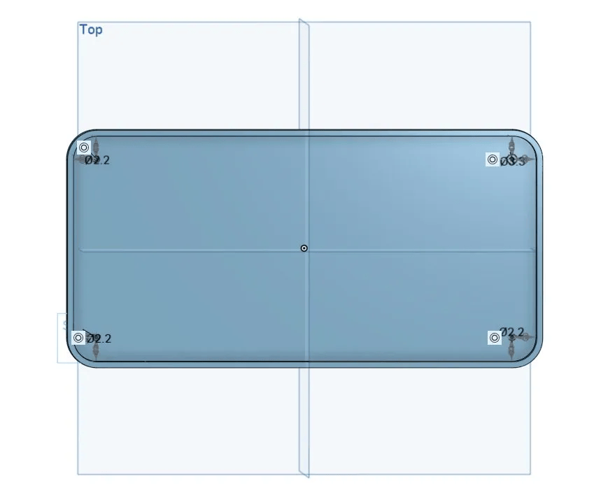

---------------

After that i added two cutouts on the side wall of the bottom shell
- One for the Micro Usb slot for charging 9x4.5mm from bottom for powerboost charging module
- and second for the slide switch 8x4mm and 15mm from usb slot so it is placed a bit further

---------------
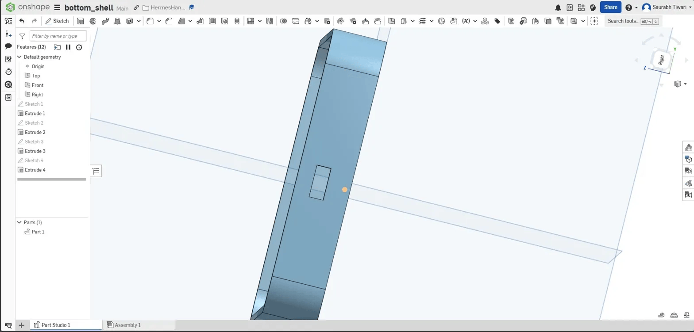

---------------
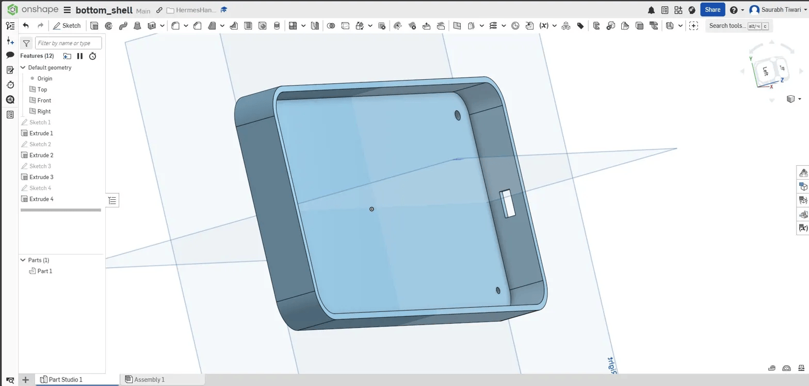

---------------
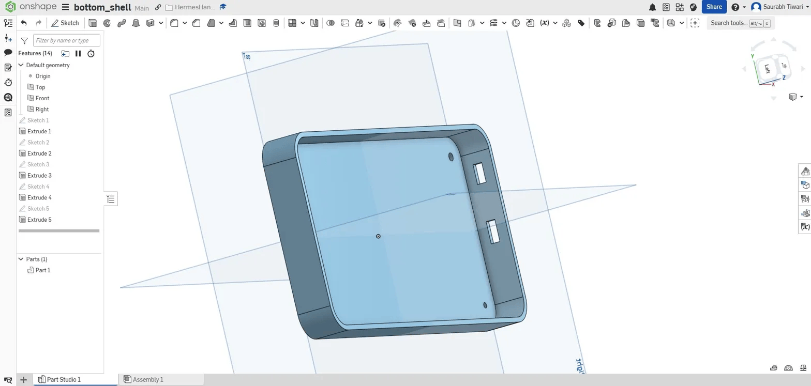

---------------

After this the bottom shell was finally complete!! then i started workikng on the smaller parts like the buttons etc
I started wit the power button first a small circle then a stem then i rounded it a bit.

---------------
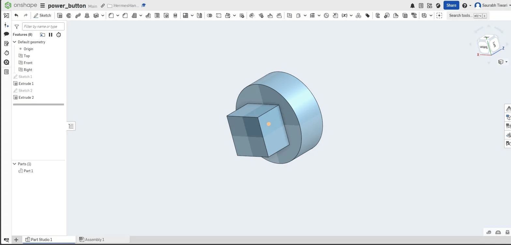

---------------

Similarly i started the ABXY button it is one button design but weve to print 4 of it for each action A B X and Y i didnt engrave text on it as it would be difficult to print properly.

---------------

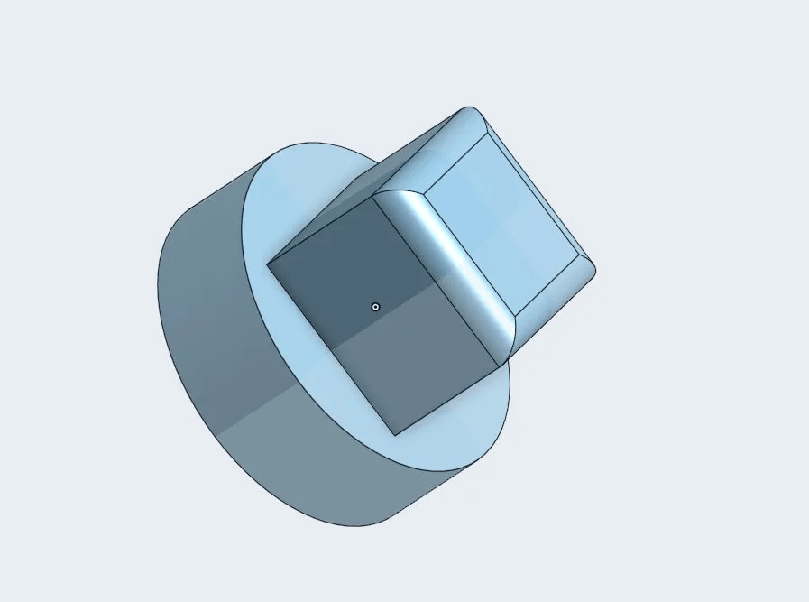

---------------

Now it was time for the DPad I wanted a GBA styled dpad with individual 6x6x5mm tactical switch beneath it so i started with two rectangles sketch and added a pivot at the bottom so it would work properly for movements in any direction

---------------

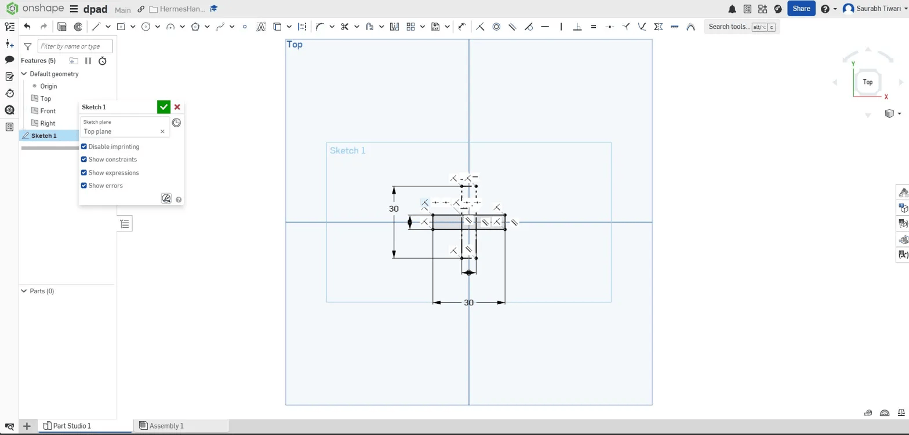

---------------
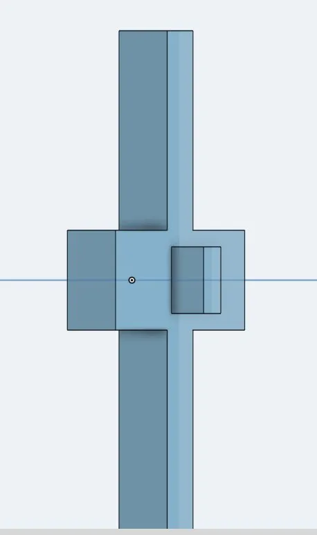

---------------

But it was not looking like a dpad something was off so i tried making the rectangles X cross to be of similar size like a square i changed the dimensions from 30 to 22 and from 12 to 8mm

---------------
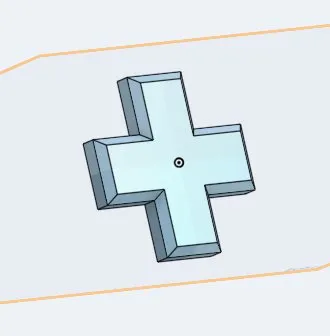

---------------

Finally before ending todays cad session i tried making the top shell just the hollow shell with same dimensions as the bottom shell with fillet used on the corners for consistency. it is unfinished atm.
---------------
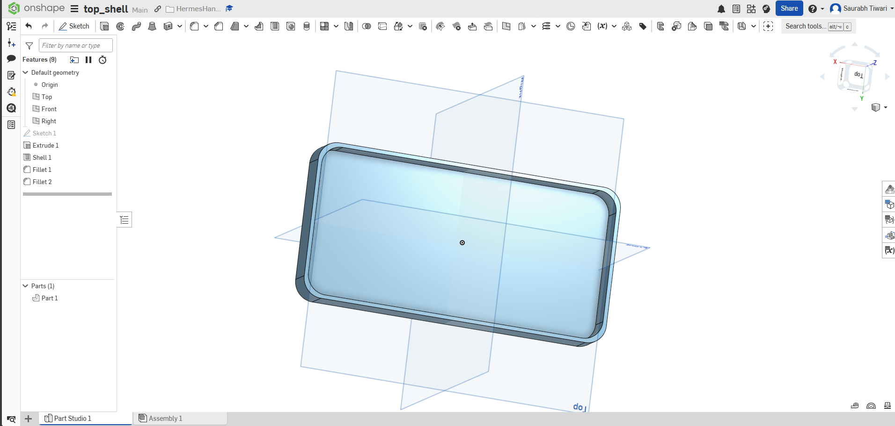

---------------

**Total time spent: 2 hours**
