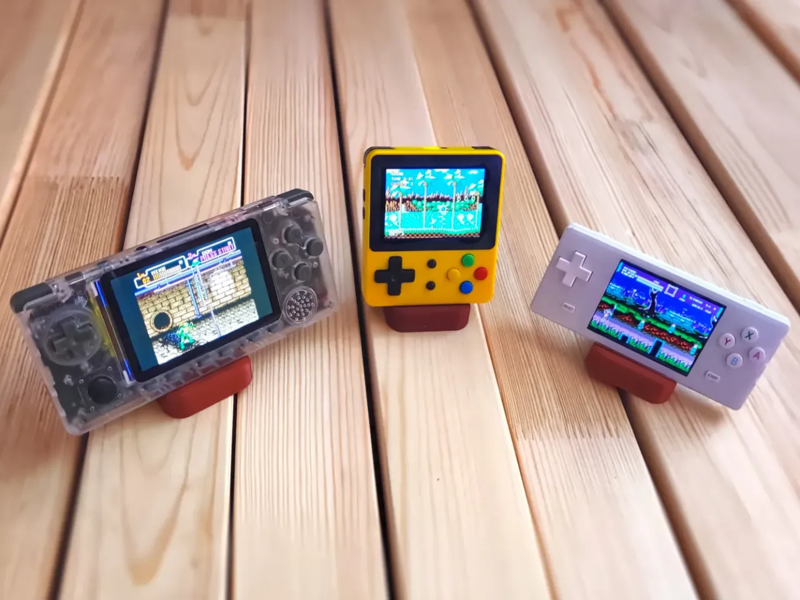

# April 14: Project planning and setup

Today I finalized the idea for the project which is to build a handheld retro game console using a pi zero 2w. I spent time researching existing designs for inspiration and to understand how components like display, buttons and battery are integrated. One key decision was to not directly copy an existing design and instead focus on building my own version with a clean and minimal layout. I also created a github repo and structured it according to the forge docs and this is my first journal entry. My next step would be to start working on the internal layout, select components for the project and create a bom.md and stl files for the enclosure. Also I found a cover page image from the internet.

Inspiration Image:
This is what i want to make as the final product a handheld which can run my fav retro games like pokemon fire red or maybe advance wars!

**Total time spent: 1 hour**
