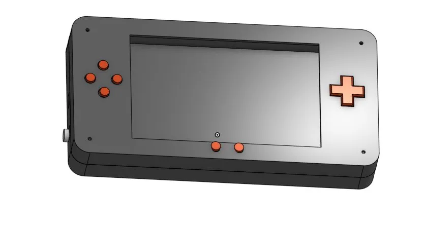

# HermesHandheld

A portable handheld retro gaming console built from scratch using a Raspberry Pi Zero 2W with a 5" display, physical controls, battery management, and audio output. Designed to run NDS and other retro emulators.



---

## What is it?

Hermes is a fully custom handheld gaming console 3D printed case, hand-wired controls, and a Pi Zero 2W running emulators. Everything from the schematic to the CAD was designed from scratch.

---

## Features

- Raspberry Pi Zero 2W (64-bit, capable of NDS emulation)
- Waveshare 5" HDMI display
- ABXY buttons + D-Pad + Start/Select
- LiPo battery (3000mAh) with Adafruit PowerBoost 1000C for stable 5V + charging
- 3.5mm wired audio jack
- Slide switch power on/off
- Fully 3D printed enclosure (195×100×15mm)
- MicroUSB charging port

---

## Repo Structure

```
HermesHandheld/
├── JOURNAL.md          # Build log with progress photos
├── bom/bom.md          # Full bill of materials
├── cad/                # STL files for 3D printing
├── schematics/         # KiCad schematic + PDF export
└── images/             # All journal and build images
```

---

## CAD

All parts designed in OnShape from scratch.

[View OnShape Assembly](https://cad.onshape.com/documents/3f5750065cdf21957d49744e/w/c6da2cc7c075b2bb5bd5add7/e/7ea9707faccdc6ff577339ba?renderMode=0&uiState=69eb2566edc4832fe42eea81)

Printable STLs are in the `/cad` folder:
- `top_shell_ds.stl`
- `bottom_shell_ds.stl`
- `abxy_button.stl` (print x4)
- `dpad.stl`
- `power_button.stl`

---

## Schematic

Designed in KiCad. Uses Pi Zero 2W internal pull-ups for buttons (no external resistors needed).

[View Schematic PDF](schematics/HermesHandheld.pdf)

---

## Bill of Materials

[View BOM](bom/bom.md)

| Part | Details |
|---|---|
| Raspberry Pi Zero 2W | Main compute |
| Waveshare 5 Display | 121×76mm HDMI |
| Adafruit PowerBoost 1000C | LiPo charging + 5V boost |
| LiPo Battery 3000mAh | 3.7V, 60×50mm |
| Tactile buttons (x10) | 6×6×5mm |
| 3.5mm audio jack | Wired audio via GPIO18 |
| Slide switch | Power on/off |

---

## Build Journal

Full build log with progress photos: [JOURNAL.md](JOURNAL.md)

---

## Status

> In Progress — CAD complete, schematic done, assembly pending
